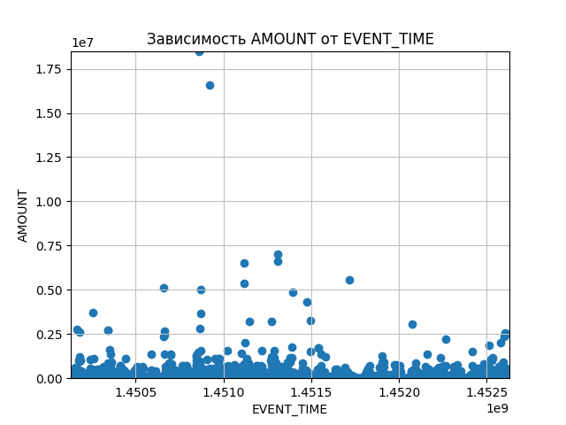
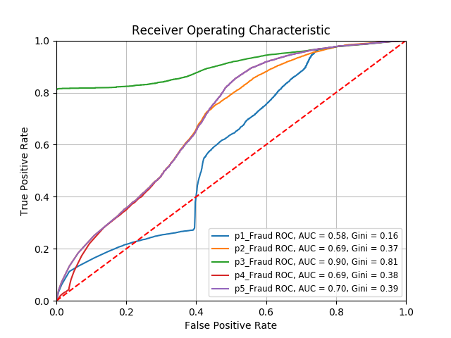
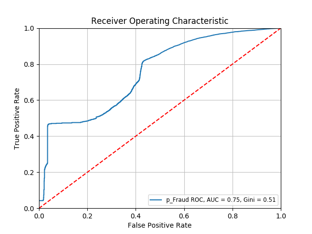
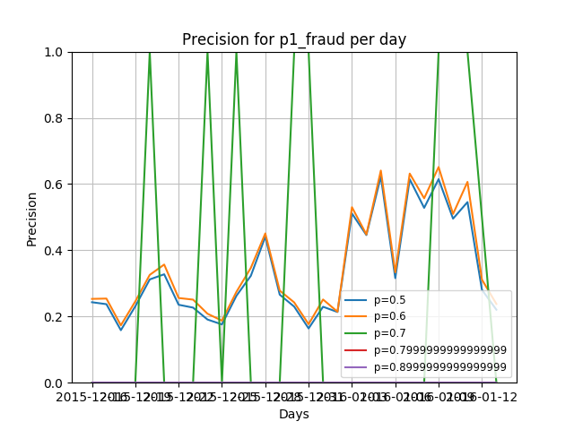
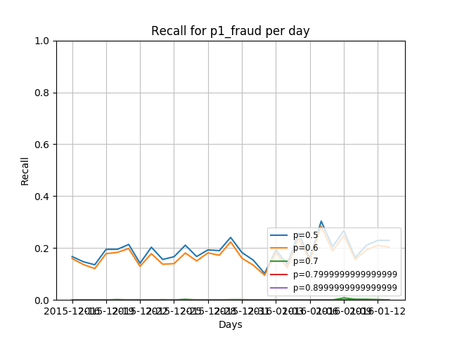
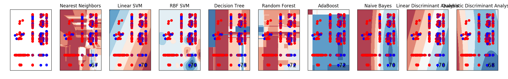

```
Загрузите данные из *.csv файла. Каждая строка – это событие.
p1_fraud, p2_fraud, p3_fraud. – априорными вероятностями фрода с точки зрения различных
экспертных систем. RESOLUTION показывает, действительно ли транзакция была фродовой.
(G – подлинная транзакция, F – фродовая, U – неизвестно)
```


> Задача 1.

> 1. Напишите функцию, строящую на плоскости точки от двух переменных (Xi, Xj) Сами
Xi и Xj подаются на вход системы.

> 2. Проанализируйте всевозможные комбинации признаков. (Каково их количество,
кстати?)

> Выберете 2-3 наиболее характерных пары признаков и сохраните их в *.jpg файлах.

```
1. На рассмотрение были взяты следующие столбцы с характеристиками: '
  EVENT_TIME', 'AMOUNT', 'X2', 'X9', 'X10', 'X11', 'X12', 'X13', 'X14', 'X15', 'X16', 'X17', 'X18', 'X22', 'X24' и их комбинации без перестановок.
2. 105 комбинаций. Комбинации с перестановками не рассматриваются в силу симметричности получающихся графиков.
```


*остальные картинки в папке pictures_task1/*

> Задача 2.

> 1. Предположим, что решающее правило >=0.5 – фрод, в остальных случаях – не фрод.
По указанной выборки рассчитать: true positive, false positive, true negative, false
negative для всех правил

> 2. Для каждой ЭС найдите порог решающего правила, для которого false positive не
более 0.2

> 3. Найдите полноту и точность.

```
p1_Fraud System
	true positive rate
	 0.2737922454903587
	false positive rate
	 0.3923024630026669
	true negative rate
	 0.6076975369973331
	false negative rate
	 0.7262077545096413
	threshold rule for false positive rate < 0.2
	 0.6900000000000004
	recall
	 0.18517739447482823
	precision
	 0.2603766144138815
```
```
p2_Fraud System
	true positive rate
	 0.7220609579100146
	false positive rate
	 0.42848925377817293
	true negative rate
	 0.5715107462218271
	false negative rate
	 0.27793904208998543
	threshold rule for false positive rate < 0.2
	 0.7900000000000005
	recall
	 0.3892366156253493
	precision
	 0.45946302526551885
```
```
p3_Fraud System
	true positive rate
	 0.8440804478540328
	false positive rate
	 0.31522250692882914
	true negative rate
	 0.6847774930711709
	false negative rate
	 0.1559195521459672
	threshold rule for false positive rate < 0.2
	 0.5400000000000003
	recall
	 0.38338748410792484
	precision
	 0.5745942131263232
```
```
p4_Fraud System
	true positive rate
	 0.5566037735849056
	false positive rate
	 0.34414056371908175
	true negative rate
	 0.6558594362809183
	false negative rate
	 0.44339622641509435
	threshold rule for false positive rate < 0.2
	 0.5300000000000002
	recall
	 0.29975992406900787
	precision
	 0.4492887029288703
```
```
p5_Fraud System
	true positive rate
	 0.8680281982168775
	false positive rate
	 0.5268001882549809
	true negative rate
	 0.47319981174501907
	false negative rate
	 0.1319718017831225
	threshold rule for false positive rate < 0.2
	 0.9900000000000007
	recall
	 0.4805992423372747
	precision
	 0.4538949422670353
```

> Задача 3.

> 1. Постройте ROC кривую для каждого правила.

> 2. Найдите коэффициент Джини для каждого правила.



> Задача 4.

> 1. Создайте ансамбль в виде функции голосования при пороге каждого правила >=0.5,
>=0.8. Найдите необходимые пороги для каждого правила ЭС, чтобы false positive
ансамбля была минимальна.
> 
2. Создайте ансамбль в виде p = (p1_fraud + p2_fraud + p3_fraud)/3. Постройте ROC
кривую.

```
p = 0.5
false positive rate 0.28643997511922037
p = 0.8
false positive rate 0.9550072568940493

rules for ensemble: (0.9, 0.8, 0.5, 0.4, 0.6)
minimum fpr: 0.1846361185983828
```


> Задача 5.

> 1. Зададим ансамбль через параметры A, B, C:
p =(A*p1_fraud+B*p2_fraud+C*p3_fraud)/(A+B+C).
Найдите A, B, C, чтобы индекс Джини ансамбля был бы максимальным. При каких A,
B, C индекс Джини минимален? Найдите A, B, C для максимального true positive при
условии, что false positive должен быть равен 0.1. Каков порог решающего правила?

*слишком большой перебор параметров, я не дождалась окончания перебора*

> Задача 6.

> 1. Постройте зависимость точности от pi_fraud для i от 1 до 3 для каждого дня.

> 2. Аналогично п.1 постройте зависимость полноты от pi_fraud.

> 3. Найдите SSI




*Остальные картинки в папке pictures_task6/*

> Задача 7.

> Предположим, что при верной сработки мы “спасаем” деньги клиентов, равные
AMOUNT_RUB. При сработке клиента блокируют. Заблокированный клиент звонит в 90%
случаев в контактный центр. Цена разговора с клиентом 400 рублей. Если клиента несправедливо заблокировали, то банк терпит “репутационные издержки”, оцененные в 2000
рублей. 

> Постройте уравнение для расчета CBA. Решите это уравнение.

```
p1_fraud max CBA: 137337532.71 with p = 0.2
p2_fraud max CBA: 165073941.48000002 with p = 0.2
p3_fraud max CBA: 161616706.19000006 with p = 0.2
p4_fraud max CBA: 166080387.62999994 with p = 0.2
p5_fraud max CBA: 161036874.59000003 with p = 0.2
```

> Задача 8.

> Посмотрите страницу http://scikit-learn.org/stable/auto_examples/classification/plot_classifier_comparison.html
Разбейте выборку на обучающую и проверочную. Реализуйте алгоритмы классификации,
взяв в качестве признаков Xi а в качестве алгоритмов то, что вам предлагают.…
Сравните с pi_fraud.


