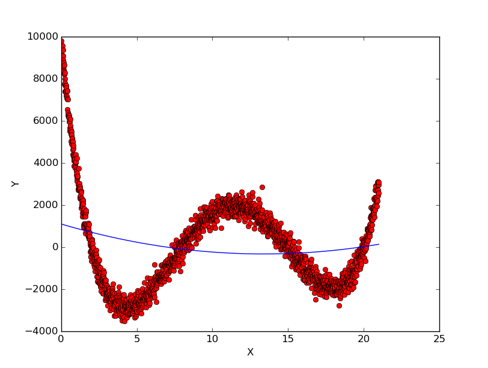
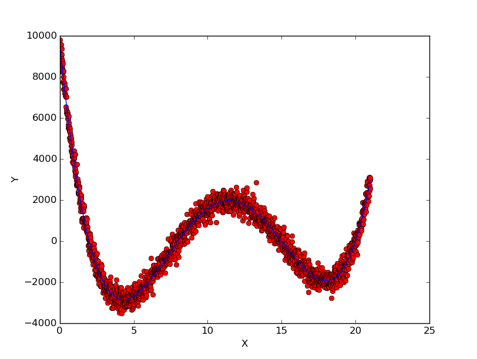

## TO DO
> 1.
Просмотрите данные в regression_x_y.csv файле. Постройте график по точкам.

**???:** Уточните: нанести данные на график (точки) или ещё и построить регрессию? Я нанесла точки на график и построила регрессию по полиному 4-ой степени.

> 2.
Придумайте способ удалить выбросы. Напишите функцию удаления выбросов и
сохраните результат в файл regression_x_y.2.csv. Постройте график по точкам.

**???:** Удалить выбросы, сходя из сырых данных, загруженных из .csv или применив построение регресии? Вопрос про график как в пункте 1.

> 3.
Задайте функцию штрафа как A - g(x, 0, sigma), где g(x, 0, sigma) -- гаусова
функцию с матожиданием в нуле. Чему разумно задать константу A и
среднеквадратичное отклонение (sigma)?

**???:** У меня получилась какая-то полная белиберда. По гауссовской функции (как в википедии) строится тупо прямая. Я чего-то не понимаю.

> 4.
Известно, что функция регрессии представляет собой полином четвертой степени.
Напишите функцию штрафа, которая принимает на вход коэфициенты полинома, а на
выходе выдает штраф по точкам.

**DONE:** Тут вроде всё нормально. Штраф для каждой точки отдельно выводить в файл или можно посчитать общий штраф (сложив все штрафы)?

> 5.
Методом перебора найдите функцию с наименьшим штрафом.

**???:** Перебирать __функции__?? Или коэффициенты к полиному 4ой степени из предыдущего пункта?

> 6.
Байесовский подход. Аналогично п.5 перебором из 10000 различных вариантов
найдите 1-10% наиболее подходящих функций. Постройте эти функции методом:
plt.plot(X, [func_reg(x) for x in X], 'b-', alpha=0.05, linewidth=4). Возможно
разумно задать другие alpha и linewidth?

**???:**  см. пункт выше

> 7.
Выполните п.3-6, изменив функцию штрафа. Изменился результат?

**???:** он в любом случае изменится, если изменится функция штрафа. Нет?

> 8.
Выполните п.3-6, изменив степень полинома. Что будет при степени 2, 3, при степени
5, 6, 7? Как изменился результат?

**???:** Для степеней 2 и 3 заметно, для 5, 6, 7 - нет.

